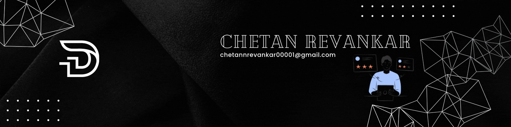

    

<h1 align="center">I'm Chetan Revankar</h1>
<h3>🚀 Smart Data | Smarter Future | Smart AI 🤖</h3>

---

🌟 I’m on a mission with Data Engineering

🌱 I’m exploring some mind-blowing stuff like Generative AI

💬 Wanna know something cool ? Ask me about Data Engineering , Full Stack GenAI , Networking CCNA

⚡ Crazy little secret...! I’m a Data Engineer by day, Full Stack GenAI developer by night, and a CCNA ninja whenever the Wi-Fi goes down!

---

<h3 align="center">🌐 Connect with me</h3>

  

---

<h3 align="center">🛠️ Languages & Tools</h3>

  
  
  
  
  
  
  
  
  
  
  
  
  
  
  
  
  
  
  
  
  
  
  
  

---

<h3 align="center">🔥 Top Skills Used</h3>

  
  
  
  

---

<h3 align="center">📊 GitHub Stats:</h3>

    

---
